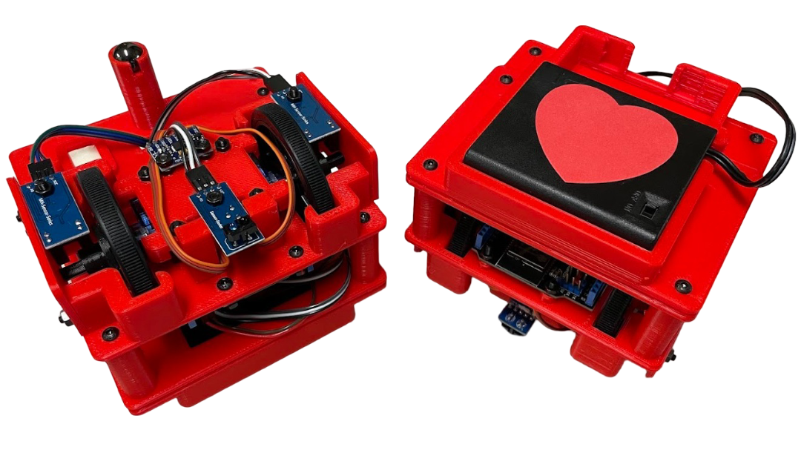

# PySTEM Mini Bot

## Project Overview

The PySTEM Mini Bot is an open-source educational robotics platform. Created by Rick Zhou and Kevin Zhou, this project provides an affordable alternative to expensive educational robotics kits.

## Core Components
- **Microcontroller**: ESP32 chip with WiFi/bluetooth connectivity
- **Chassis**: 3D-printed design
- **Motors**: Two continuous microservo-powered wheels with encoders
- **Sensors**: IR reflective sensor for line detection and color recognition
- **Power**: 6V battery pack
- **Wiring**: Solderless assembly

## Getting Started

1. Visit [robot.pystem.com](https://robot.pystem.com/)
2. Follow assembly instructions to prepare and assemble your robot
3. Flash firmware following the instructions
4. Start programming with the browser IDE
