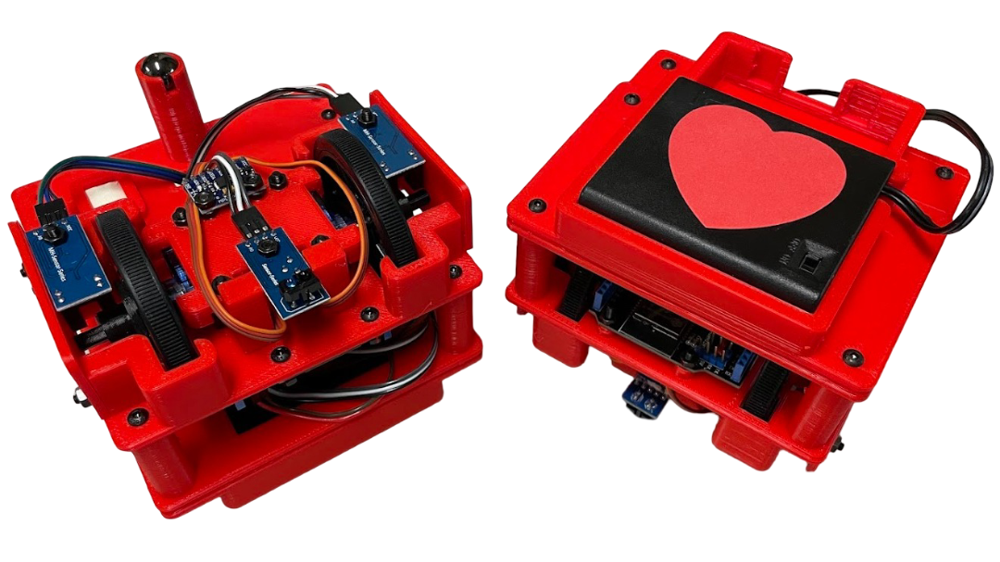

# PySTEM Mini Bot

## Project Overview

The PySTEM Mini Bot is an open-source educational robotics platform. Created by Rick Zhou and Kevin Zhou, this project provides an affordable alternative to expensive educational robotics kits.

## Core Components
- **Microcontroller**: ESP32 chip with WiFi/bluetooth connectivity
- **Chassis**: 3D-printed design
- **Motors**: Two continuous microservo-powered wheels with encoders
- **Sensors**: IR reflective sensor for line detection and color recognition
- **Power**: 6V battery pack
- **Wiring**: Solderless assembly

## Technical Challenges

### 1. Motor Encoder Noise and Debouncing

The LM393 encoder modules generate 20 pulses per wheel revolution, but in practice the raw signal was noisy — spurious pulses from electrical interference caused the robot to miscount its position, leading to unpredictable movements and overshooting targets.

**Solution:** I implemented a multi-layer debouncing strategy in the encoder interrupt handler. A 5ms time-based filter ignores pulses that arrive faster than physically possible, filtering out electrical noise without losing real data. I also added `Pin.PULL_UP` to stabilize the digital input, and built a separate 200ms debounce for the start button interrupt to prevent false program triggers. Getting the debounce thresholds right required iterative testing on the actual hardware — too aggressive and real pulses get dropped, too lenient and noise slips through.

### 2. Precise Motor Position Control on Low-Cost Hardware

Cheap continuous microservos don't have built-in position feedback. Moving the robot a specific distance (e.g., "drive forward 360 degrees of wheel rotation") required building a closed-loop position controller from scratch using the encoder pulses.

**Solution:** I wrote a proportional controller that runs on a timer interrupt, continuously comparing the target position against the encoder count and adjusting motor power. Key engineering decisions included setting a minimum power threshold (15%) to prevent motor stalling at low speeds, a tolerance band (30 degrees) for "close enough" arrival detection to avoid oscillation, and velocity limiting to prevent overshooting. When the motor needs to hard-stop, the controller cuts the PWM signal entirely rather than sending a neutral pulse — a subtle fix that eliminated drift at rest.

### 3. Uploading Code Over Serial to a Memory-Constrained ESP32

The ESP32 has very limited filesystem space, and sending large Python files over WebSerial would frequently trigger `OSError 28` (filesystem full) or corrupt mid-transfer.

**Solution:** I designed a hex-encoding upload protocol in `robot.js`. Instead of writing the file directly, the browser converts the code to a hex string, splits it into 512-byte chunks, and sends each chunk as a MicroPython command that reconstructs the bytes on-device. The protocol includes explicit garbage collection (`gc.collect()`) between chunks to reclaim memory. This approach also avoids issues with special characters in the code breaking the serial transfer.

### 4. Building a Browser-Based IDE With No Backend

The entire programming environment runs client-side — there's no server processing code. This was a deliberate decision to eliminate setup friction (no installation, no accounts), but it meant solving problems typically handled server-side.

**Solution:** The IDE uses the Monaco Editor (the engine behind VS Code) with custom MicroPython autocomplete generated from `.pyi` stub files I wrote for the ESP32 hardware modules. File management uses `localStorage` for persistence with auto-save. The WebSerial API handles direct USB communication to the robot. I also added a Blockly-based visual programming mode (`scratch.html`) that generates Python code in real time, giving beginners a drag-and-drop entry point while still producing real, readable code.

### 5. Straight-Line Correction With an IMU

Even with matched motors, the robot drifts when driving "straight" due to slight differences in wheel friction and motor response. This is a fundamental problem with differential-drive robots.

**Solution:** I integrated the MPU-6050 accelerometer/gyroscope and wrote an orientation correction loop in the motor pair module. When driving straight, the controller reads the gyroscope heading and applies a steering offset to compensate for drift, keeping the robot on course. This required careful calibration of the sensor and tuning the correction gain to avoid over-correcting.

### 6. SPIKE Prime API Compatibility

I wanted the robot's programming interface to be familiar to students who have used LEGO SPIKE Prime, so they could transfer their skills between platforms.

**Solution:** I implemented a SPIKE Prime-compatible Python API (`sdk_motor.py`, `sdk_motor_pair.py`, etc.) that mirrors the LEGO API's function signatures and behavior. Functions like `motor_pair.move()`, `motor_pair.move_tank()`, and `motor.run_to_position()` work the same way, so example code and curriculum designed for SPIKE Prime can run on this robot with minimal changes — at a fraction of the cost.

## Getting Started

1. Visit [robot.pystem.com](https://robot.pystem.com/)
2. Follow assembly instructions to prepare and assemble your robot
3. Flash firmware following the instructions
4. Start programming with the browser IDE
